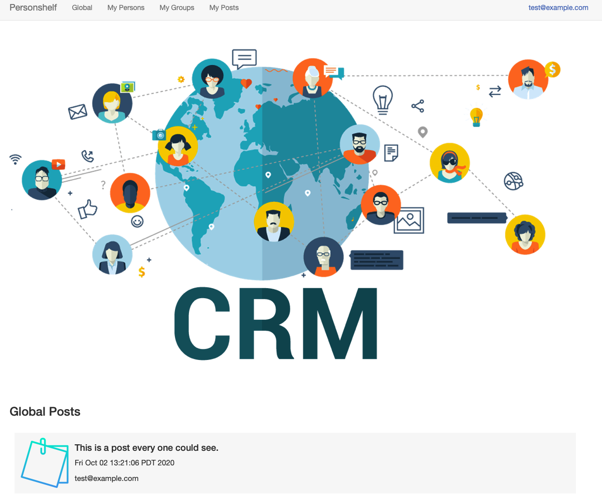
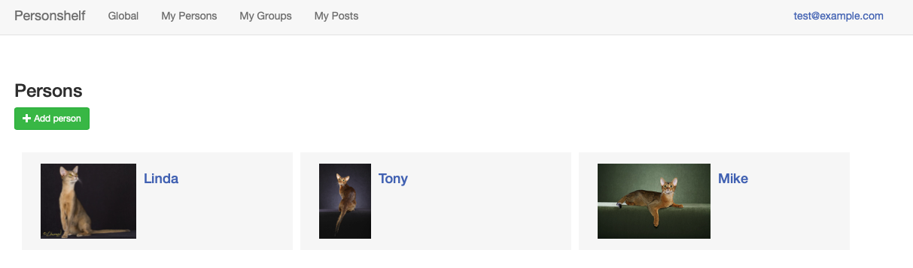
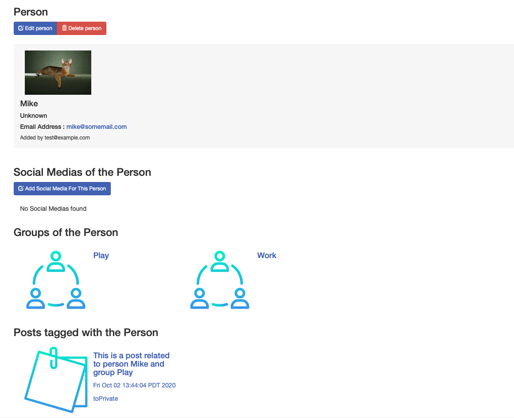
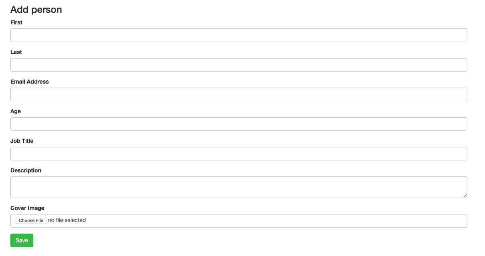
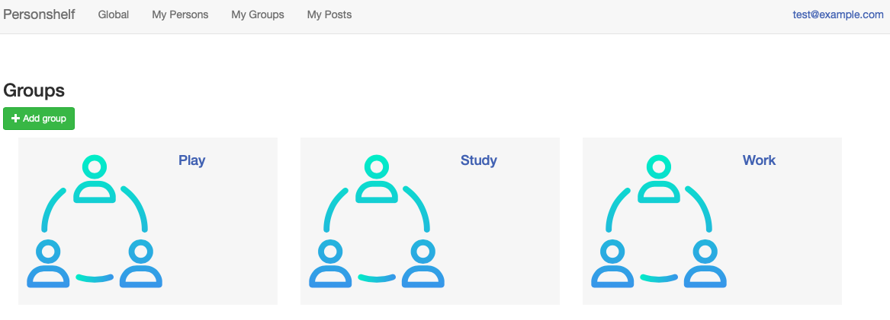
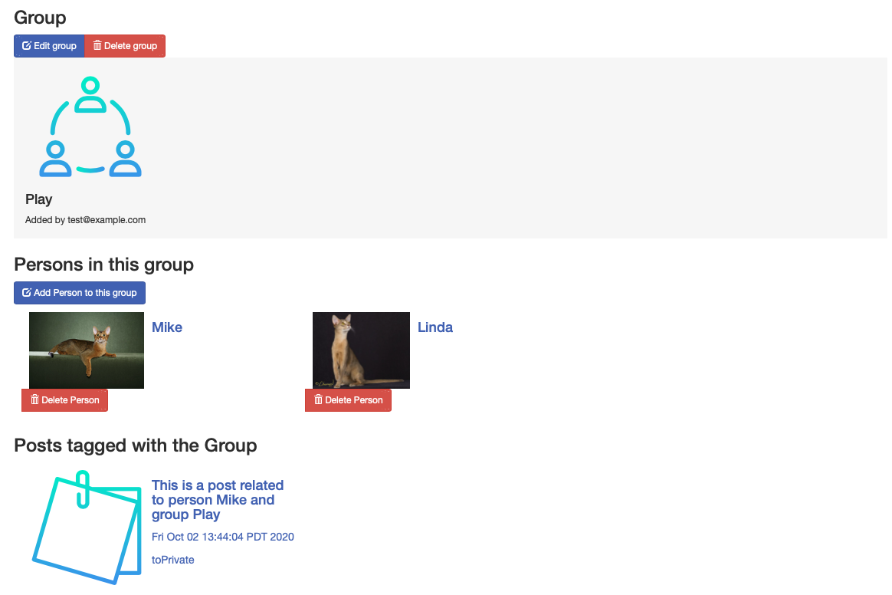
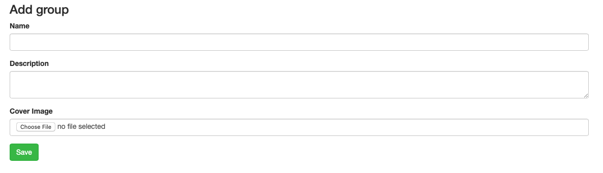
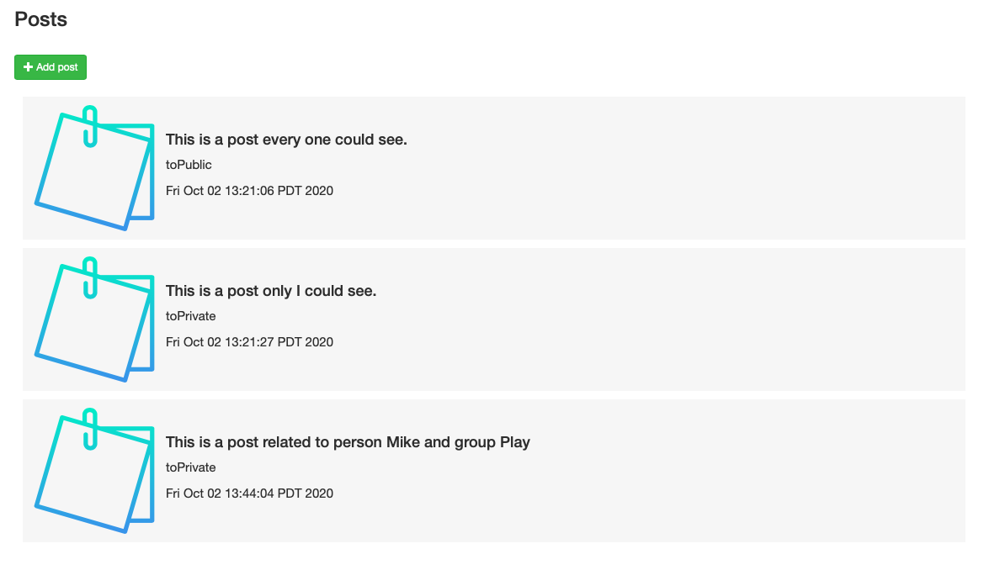
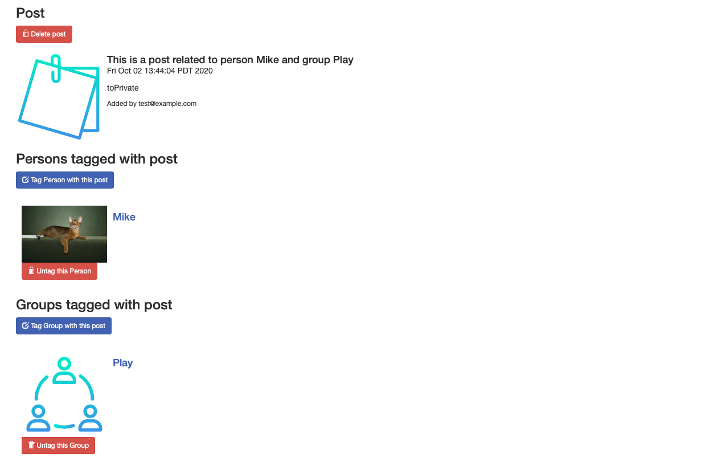

# PeopleTags, my First WebApp
This is a course project of CS514 in University of San Francisco. Our instructor is professor [David Wolber](https://www.linkedin.com/in/david-wolber-5292852/).

Author: [Sicheng Zhou](https://www.linkedin.com/in/secregister01/), [Shulin Li](https://www.linkedin.com/in/shu-lin-li/)
## Demo
PeopleTags is a personal relationship management software. First, you could add persons, then assign each person to one or more groups. If you want to publish a post, you could tag the post with persons or groups. The post could be public to all users or private to only you.

- Here is the home page displaying all public posts of all users.
 
 
- Here is the page for displaying persons.
 

- Here is the page displaying one person.
 
 
- Here is the page when adding person.
 
 
- Here is the page for displaying groups.
 
 
- Here is the page displaying one group.
 
 
- Here is the page for adding groups.
 
 
- Here is to page for displaying posts.
 
 
- Here is a page displaying one post.
  